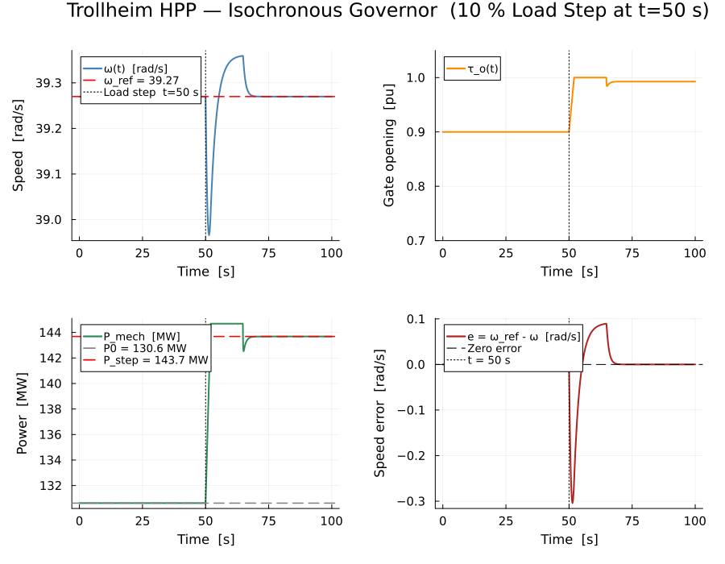
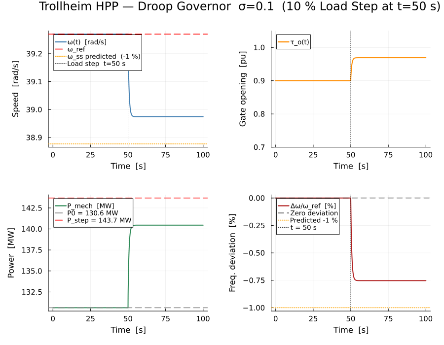

# HydroPowerDynamics.jl

**HydroPowerDynamics.jl** is an acausal, equation-based hydropower component library for Julia,
built on [ModelingToolkit.jl](https://docs.sciml.ai/ModelingToolkit/stable/).

Write hydropower plant models by connecting physically-typed components — hydraulic,
mechanical, and control — and let ModelingToolkit handle symbolic simplification
and ODE generation automatically.

---

## Component overview

| Domain | Component | Physics | Reference |
|--------|-----------|---------|-----------|
| **Hydraulic** | `Reservoir` | hydrostatic head boundary | §2.2 |
| | `Penstock` | water-hammer momentum + compressibility | §2.3 |
| | `SurgeTank` | free-surface level ODE | §2.4 |
| | `DraftTube` | kinetic energy recovery + exit loss | §2.5 |
| | `GuideVane` | variable-orifice flow equation | §2.6 |
| **Turbine** | `FrancisTurbineAffinity` | quadratic Q–H–η characteristic | §3.3 |
| | `PeltonTurbine` | jet-impact momentum model | §3.4 |
| **Mechanical** | `RotorInertia` | `J dω/dt = τ_t − τ_g − b_v ω` | §4.1 |
| | `SimpleGenerator` | algebraic torque-speed characteristic | §4.3 |
| **Governor** | `PIDGovernor` | PID with rate-limited gate saturation | §5.1 |
| | `GGOV1Governor` | IEEE Std 1207 droop + power lag model | §5.2 |

### Utility functions (`src/utils.jl`)

`gross_head` · `net_head` · `darcy_head_loss` · `power_cascade` · `plant_efficiency` ·
`wave_speed` · `joukowsky_pressure` · `critical_closure_time` · `unit_speed` ·
`unit_discharge` · `hydraulic_efficiency`

---

## Quick-start

```julia
using HydroPowerDynamics, ModelingToolkit, OrdinaryDiffEq
using ModelingToolkit: t_nounits as t, D_nounits as D

# Flat Francis turbine + rotor model
@mtkmodel TurbineSystem begin
    @parameters begin
        H = 100.0;   tau_o = 0.8;   rho = 1000.0;  g = 9.81
        D_t = 1.0;   K_q = 0.35;    eta_max = 0.92; c_eta = 0.25
        Q_rated = 8.0; J = 500.0;   b_v = 2.0
        P_rated = 2e6; omega_s = 157.08;  D_d = 1.5
    end
    @variables begin
        omega(t) = 1.0;  Q(t);  eta(t);  P_mech(t)
        tau_turbine(t);  tau_gen(t)
    end
    @equations begin
        Q           ~ tau_o * K_q * D_t^2 * sqrt(H)
        eta         ~ eta_max * (1 - c_eta*(Q/Q_rated - 1)^2)
        P_mech      ~ rho * g * Q * H * eta
        tau_turbine ~ P_mech / (abs(omega) + 1e-4)
        tau_gen     ~ (P_rated/omega_s)*(1 + D_d*(omega - omega_s)/omega_s)
        D(omega)    ~ (tau_turbine - tau_gen - b_v*omega) / J
    end
end

@mtkcompile sys = TurbineSystem()
sol = solve(ODEProblem(sys, Pair[], (0.0, 10.0)), Tsit5())
```

---

## Trollheim HPP — Benchmark Examples

The [`quick_examples/`](quick_examples/) folder and root-level scripts demonstrate full-plant
simulation of the **Trollheim high-head Francis HPP** (≈130 MW, H = 371 m, n = 375 RPM).

### Plant data (Operating Point B)

| Symbol | Value | Description |
|--------|-------|-------------|
| $H_n$ | 371 m | Net head |
| $\dot{V}_n$ | 37 m³/s | Nominal discharge |
| $P_r$ | ≈130 MW | Rated mechanical power |
| $n$ | 375 RPM → $\omega_\text{ref}$ ≈ 39.27 rad/s | Nominal speed |
| $L_p$ | 500 m | Penstock length |
| $T_w$ | 0.44 s | Water time constant |
| $\sigma$ | 0.10 | Static droop |
| $T_{ps}$ | 1.75 s | Pilot servo time constant |

Both examples simulate **10 % load step at t = 50 s** on a system in steady
state for t < 50 s, over a total 100 s window.

---

### Example 1 — Isochronous (ISO) Governor

**Script:** [`iso_trollheim_test.jl`](quick_examples/trollheim_iso_control/iso_trollheim_test.jl)  
**Detailed guide:** [`quick_examples/01_isochronous_control.md`](quick_examples/01_isochronous_control.md)

An isochronous PID governor maintains rotor speed at exactly $\omega_\text{ref}$ by
driving the steady-state speed error to zero via an integrator — no droop, no permanent
frequency deviation.

```
Governor:  PID   K_p = 2.0   K_i = 2.0   K_d = 0   σ = 0  (isochronous)
Step:      10 % load increase at t = 50 s
Expected:  ω returns exactly to ω_ref after transient
```

Governor equations (ISO PID):

```julia
e        ~  omega_ref - omega
D(e_int) ~  e
u_pid    ~  K_p * e + K_i * e_int
D(tau_o) ~  max(-R_close, min(R_open, (clamp(u_pid, 0.0, 1.0) - tau_o) / 0.01))
```



---

### Example 2 — Droop Governor (GGOV1-style)

**Script:** [`droop_trollheim_test.jl`](quick_examples/trollheim_droop_control/droop_trollheim_test.jl)  
**Detailed guide:** [`quick_examples/02_droop_governor_control.md`](quick_examples/02_droop_governor_control.md)

A droop governor (GGOV1, IEEE Std 1207) allows a proportional permanent speed deviation,
enabling automatic load sharing in multi-unit grid-connected operation.

```
Governor:  GGOV1   σ = 0.10   T_gov = 1.75 s   T_p = 0.05 s   K_i = 5.0
Step:      10 % load increase at t = 50 s
Expected:  ω settles at ω_ref − 0.01·ω_ref  (≈ −1 % frequency deviation)
```

Governor equations (GGOV1 droop):

```julia
P_ref     ~  P_set + K_droop * (omega_ref - omega)   # K_droop = P_r / (σ · ω_ref)
D(P_meas) ~  (P_mech - P_meas) / T_p
e_gov     ~  P_ref - P_meas
D(x_gov)  ~  (e_gov - x_gov) / T_gov
D(x_int)  ~  K_i_gov * e_gov
tau_o     ~  clamp(x_gov + x_int, 0.0, 1.0)
```



---

### ISO vs Droop — comparison

| Property | Isochronous (ISO) | Droop (σ = 0.10) |
|---|---|---|
| Steady-state Δω after 10 % step | **0  (fully restored)** | **−0.39 rad/s  (−1 %)** |
| Gate response style | Fast integral | Proportional + lagged |
| Best for | Single unit / island grid | Multi-unit, grid-connected |
| Automatic load sharing | No | Yes (proportional to rating) |

---

## Running the examples

```bash
julia --project=. quick_examples/trollheim_iso_control/iso_trollheim_test.jl
julia --project=. quick_examples/trollheim_droop_control/droop_trollheim_test.jl
```

Plots are saved alongside each script under its `images/` subfolder.

## Running the test suite

```julia
using Pkg; Pkg.test("HydroPowerDynamics")
```

---

## Mathematical reference

All governing equations, sign conventions, and symbol glossary are documented
in the detailed quick-example guides under [`quick_examples/`](quick_examples/).
