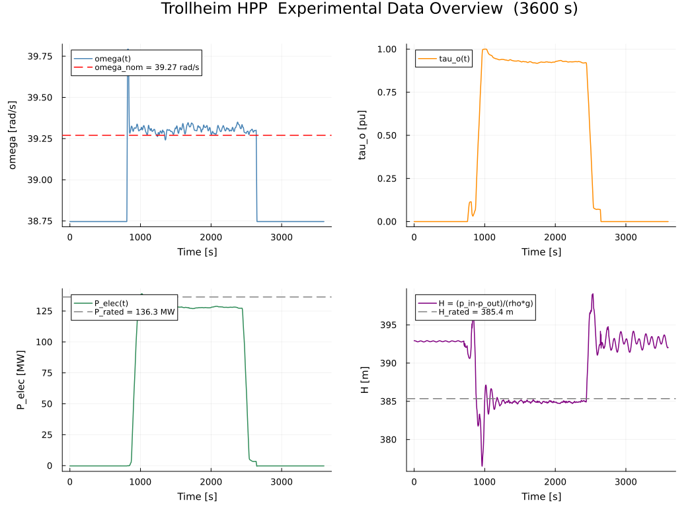
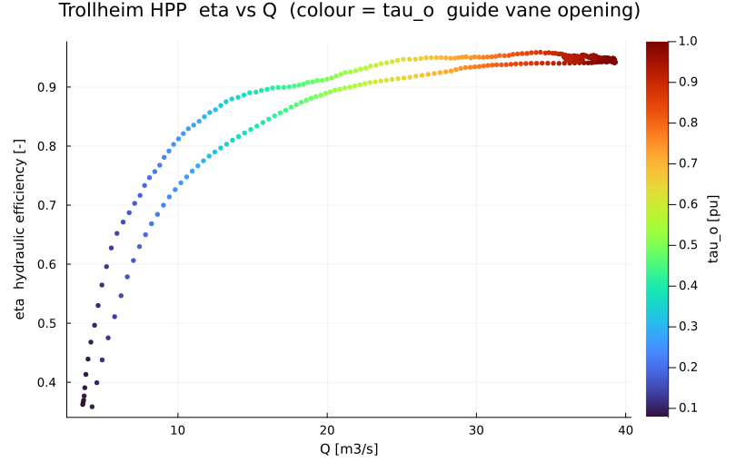
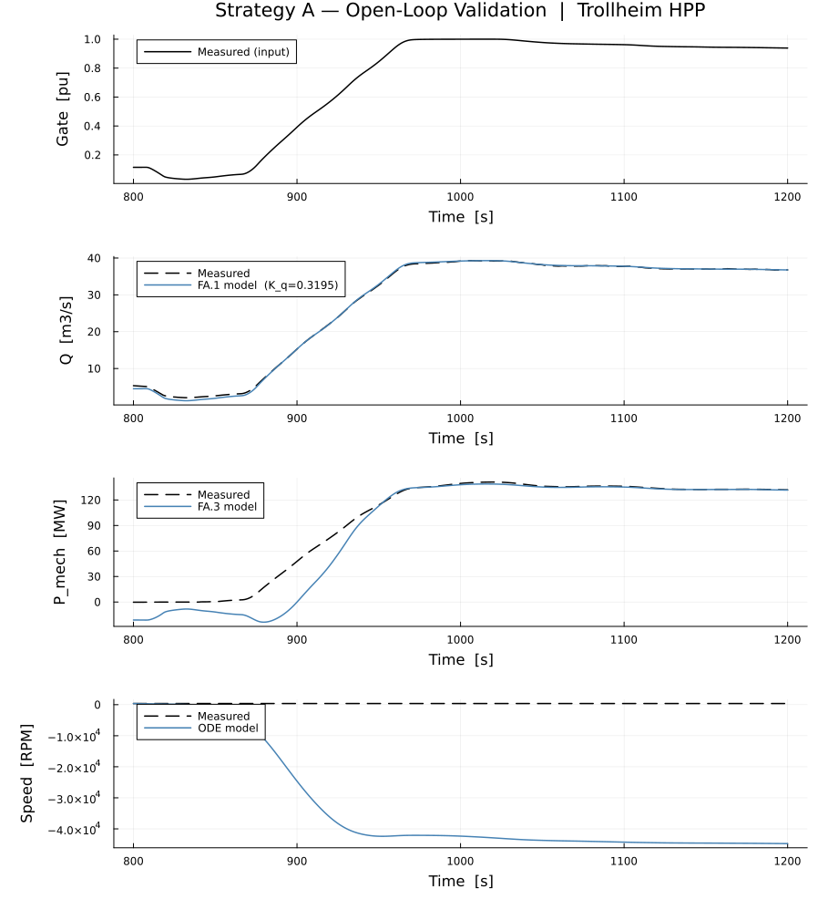
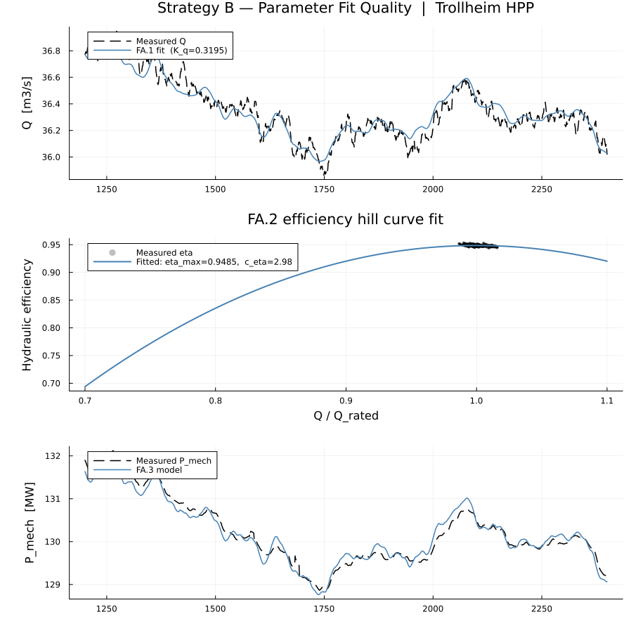

# Trollheim HPP — Experimental Data Analysis

This document describes the full pipeline for comparing the
`HydroPowerDynamics.jl` turbine model against one hour of measured plant
data from Trollheim hydropower station.

---

## 1. Dataset

| Property | Value |
|---|---|
| Source file | `data/Trollheim_data.xlsx` |
| Duration | 3600 samples · 1 s/sample = **1 hour** |
| Channels | 7 (pressures, speed, gate, power, flow) |
| Missing data | None |

### Raw channels and unit conversion

| Excel column | Unit | Library variable | Conversion |
|---|---|---|---|
| `p_penstock_a_` | kPa | `p_in` [Pa] | × 1 000 |
| `p_dt_b_` | kPa | `p_out` [Pa] | × 1 000 |
| `p_surna_a_` | m | `h_tailwater_m` [m] | direct |
| `tacho_fine_` | RPM | `omega` [rad/s] | × 2π/60 |
| `pos_servo_` | mm | `tau_o` [pu] | ÷ 99.134 |
| `power_generator_` | MW | `P_elec` [W] | × 10⁶ |
| `Q_tunnel_` | m³/s | `Q` [m³/s] | direct |

> The denominator 99.134 mm is the servo position corresponding to full gate opening,
> determined from the on-site calibration record.

### Derived variables

All derived quantities follow the `FrancisTurbineAffinity` model conventions:

$$H = \frac{p_\text{in} - p_\text{out}}{\rho g} \quad [\text{m}]$$

$$\dot{m} = \rho Q \quad [\text{kg/s}]$$

$$P_\text{mech} = \frac{P_\text{elec}}{\eta_\text{gen}}, \quad \eta_\text{gen} = 0.985$$

$$\eta = \frac{P_\text{mech}}{\rho g Q H} \quad [-]$$

### Operating periods

The one-hour record contains three distinct phases:

| Period | Time window | Description |
|---|---|---|
| Plant off | t = 0 – 850 s | P ≈ 0, gate closed |
| Startup ramp | t = 850 – 1 200 s | Gate 0.05 → 0.91 pu, P: 0 → 128 MW |
| Steady state | t = 1 200 – 2 400 s | Full-load generation |
| Shutdown ramp | t = 2 400 – 3 600 s | Gate closes, plant stops |



**Steady-state operating point** (mean over t = 1 200 – 2 400 s):

| Variable | Value |
|---|---|
| Net head $H$ | 384.9 m |
| Discharge $Q$ | 36.36 m³/s |
| Gate opening $\tau_o$ | 0.928 pu |
| Generator power $P_\text{elec}$ | 128.3 MW |
| Mechanical power $P_\text{mech}$ | 130.2 MW |
| Hydraulic efficiency $\eta$ | 0.948 |
| Speed $n$ | 375.3 RPM |



---

## 2. Turbine Model

The `FrancisTurbineAffinity` component implements a quadratic affinity-law
model with three equations that govern flow, efficiency, and power:

$$Q = \tau_o \cdot K_q \cdot D^2 \cdot \sqrt{H} \tag{FA.1}$$

$$\eta = \eta_\text{max} \left[1 - c_\eta\left(\frac{Q}{Q_r} - 1\right)^2\right] \tag{FA.2}$$

$$P_\text{mech} = \rho g Q H \eta \tag{FA.3}$$

The rotor dynamics (swing equation) are:

$$J\,\frac{d\omega}{dt} = \tau_\text{turb} - \tau_\text{gen} - b_v\,\omega \tag{M.1}$$

where $\tau_\text{turb} = P_\text{mech}/\omega$ and $\tau_\text{gen} = P_\text{load}/\omega$.

**Fixed geometry parameters**

| Parameter | Symbol | Value | Source |
|---|---|---|---|
| Runner diameter | $D$ | 2.5 m | turbine drawing |
| Rotor inertia | $J$ | 6.775 × 10⁵ kg·m² | $M_a = 8\,\text{s}$ starting time |
| Viscous damping | $b_v$ | 50 N·m·s/rad | assumed |
| Generator efficiency | $\eta_\text{gen}$ | 0.985 | assumed |

The three model parameters $[K_q,\, \eta_\text{max},\, c_\eta]$ are the fitting targets.

---

## 3. Strategy A — Open-Loop Validation

**Script:** [`02_openloop_validation/openloop_validation.jl`](02_openloop_validation/openloop_validation.jl)

### Method

The measured gate signal $\tau_o(t)$ is fed directly into equations FA.1–FA.3,
bypassing the governor entirely. This isolates turbine model accuracy
from governor tuning.

**Algebraic channel predictions** (no ODE required):

$$Q_\text{model}(t) = \tau_o^\text{meas}(t) \cdot K_q \cdot D^2 \cdot \sqrt{H^\text{meas}(t)}$$

$$\eta_\text{model}(t) = \eta_\text{max}\!\left[1 - c_\eta\!\left(\frac{Q_\text{model}}{Q_r} - 1\right)^{\!2}\right]$$

$$P_\text{mech,model}(t) = \rho g\, Q_\text{model}(t)\, H^\text{meas}(t)\, \eta_\text{model}(t)$$

**Speed ODE** — the measured generator load $P_\text{mech}^\text{meas}(t)$ is used as
the electrical load forcing; only $\omega(t)$ is integrated:

$$J\,\dot{\omega} = \frac{P_\text{mech,model}}{\omega} - \frac{P_\text{mech}^\text{meas}}{\omega} - b_v\,\omega$$

### Validation window

t = 800 – 1 200 s  (covers the 107 s startup ramp through early steady state).

### Results

Model parameters used (from Strategy B fit):

| Parameter | Value |
|---|---|
| $K_q$ | 0.3195 |
| $\eta_\text{max}$ | 0.9485 |
| $c_\eta$ | 2.983 |
| $Q_r$ | 36.36 m³/s |



---

## 4. Strategy B — Steady-State Parameter Fitting

**Script:** [`03_parameter_fitting/fit_turbine_params.jl`](03_parameter_fitting/fit_turbine_params.jl)  
**Output:** [`03_parameter_fitting/fitted_params.toml`](03_parameter_fitting/fitted_params.toml)

### Method

Using the 1 201-point steady-state window (t = 1 200 – 2 400 s), all three
parameters are fitted analytically with ordinary least squares — no numerical
optimiser is required.

#### Fitting $K_q$ from FA.1

Define the basis function $f_i = \tau_{o,i} \cdot D^2 \cdot \sqrt{H_i}$.
FA.1 becomes the single-parameter linear model $Q_i = K_q f_i$, giving:

$$\hat{K}_q = \frac{\sum_i f_i\, Q_i}{\sum_i f_i^2}$$

#### Fitting $\eta_\text{max}$ and $c_\eta$ from FA.2

With $x_i = Q_i / Q_r - 1$, equation FA.2 is linear in the two unknowns:

$$\eta_i = \underbrace{\eta_\text{max}}_{a} - \underbrace{\eta_\text{max}\,c_\eta}_{b}\; x_i^2$$

The OLS problem $\mathbf{A}\mathbf{\theta} = \boldsymbol{\eta}$ with
$\mathbf{A} = [\mathbf{1},\; -\mathbf{x}^2]$ is solved directly:

$$[\hat{a},\,\hat{b}] = \mathbf{A}^+\,\boldsymbol{\eta}, \qquad
\hat{\eta}_\text{max} = \hat{a}, \quad \hat{c}_\eta = \hat{b}/\hat{a}$$

> $Q_r$ is set to the mean measured SS flow (36.36 m³/s), placing the
> efficiency peak at the actual operating point.

### Results

| Parameter | OP-B design | **Fitted from data** |
|---|---|---|
| $K_q$ | 0.3415 | **0.3195** |
| $\eta_\text{max}$ | 0.97 | **0.9485** |
| $c_\eta$ | 0.25 | **2.983** |
| $Q_r$ | 37.0 m³/s | **36.36 m³/s** |

The large $c_\eta$ value (≈ 12× the design guess) reflects the narrow
efficiency hill typical of high-head Francis turbines — the unit operates
very close to its best-efficiency point and efficiency drops steeply off-BEP.

**Fit quality** (1 201 SS points):

| Channel | RMSE | Relative error |
|---|---|---|
| $Q$ | 0.071 m³/s | 0.20 % |
| $\eta$ | 0.0016 | 0.17 % |
| $P_\text{mech}$ | 0.14 MW | 0.11 % |



---

## 5. Folder Structure

```
trollheim_experimental/
├── ANALYSIS.md                          ← this document
├── images/
│   ├── trollheim_overview.png           ← all 7 channels over 1 hour
│   └── trollheim_efficiency.png         ← η vs Q/Q_r scatter
├── 01_preprocessing/
│   ├── preprocess_trollheim.jl          ← raw Excel → SI units CSV
│   └── trollheim_processed.csv          ← output (t, H, Q, omega, tau_o, …)
├── 02_openloop_validation/
│   ├── openloop_validation.jl           ← Strategy A script
│   └── images/openloop_comparison.png
└── 03_parameter_fitting/
    ├── fit_turbine_params.jl            ← Strategy B script
    ├── fitted_params.toml               ← fitted K_q, eta_max, c_eta
    └── images/parameter_fit.png
```

## 6. Reproducing the Results

Run in order from the package root:

```bash
# Step 1 — preprocess raw Excel into SI-unit CSV
julia --project=. quick_examples/trollheim_experimental/01_preprocessing/preprocess_trollheim.jl

# Step 2 — fit turbine parameters from steady-state data
julia --project=. quick_examples/trollheim_experimental/03_parameter_fitting/fit_turbine_params.jl

# Step 3 — open-loop dynamic validation
julia --project=. quick_examples/trollheim_experimental/02_openloop_validation/openloop_validation.jl
```
